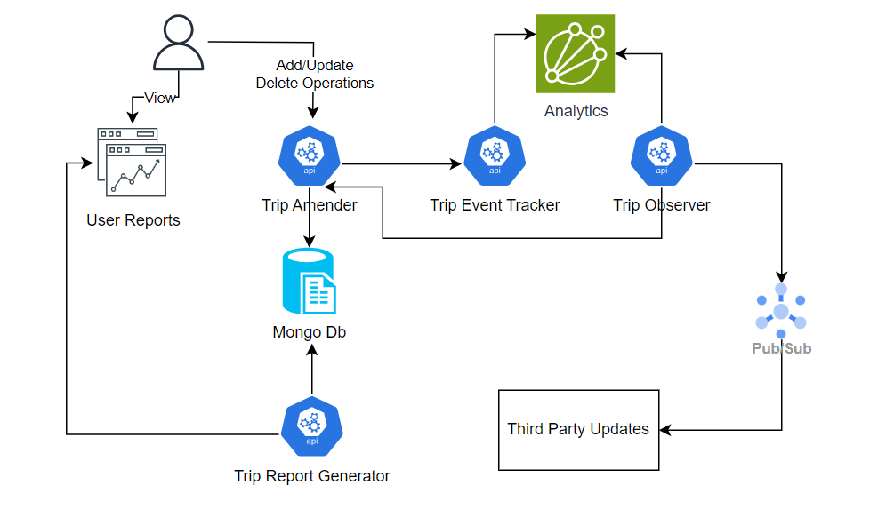

# Contents
[I. Overview](#_toc145782582)

[II. Vision](#_toc145782583)

[III. Goals and Opportunities](#_toc145782584)

    * [Immediate Business Goals](#_toc145782585)

    * [Long-Term Business Goals](#_toc145782586)

    * [Business opportunity](#_toc145782587)

[IV. Use Cases](#_toc145782588)

    [Customer Dashboard Journey](#_toc145782589)

[V. Architectural Characteristics](#_toc145782590)

[VI. High-Level Architecture](#_toc145782591)

[Architecture Approach](#_toc145782592)

[Component Diagram](#_toc145782593)

[Services](#_toc145782594)

[VII. Mid-Level Architecture	](#_toc145782595)

[Publisher/Subscriber	](#_toc145782596)

[API Layer	](#_toc145782597)

[Social Media API Manager	](#_toc145782598)

[Notification systems	](#_toc145782599)

[VIII. Evaluation, Risks and Architecture Fitness	](#_toc145782600)

[Failure Operations](#_toc145782601)

[IX. ADRs	](#_toc145782602)

[ADR 1: Microservices Architecture	](#_toc145782603)

[ADR 2: AWS	](#_toc145782604)

[ADR 3: Serverless	](#_toc145782605)

[ADR 4: Kafka Distributed Services ](#_toc145782606)

##
##
##
##
## **I. Overview**
The Road Warrior is a dynamic start-up driven by a strong passion for enhancing user experiences through our Real-Time Unified Dashboard, right at your fingertips.

Our app is designed to empower users with instant access to Real-Time updates for their travel itineraries across various channels and vendors. Whether it's changes in flight schedules or the finer points of hotel check-ins, our platform utilizes a range of notification methods to keep travellers informed and in control.

But we don't stop there; we're also here to help you share these memorable moments with your friends on social media, transforming individual experiences into shared memories. Join us on The Road Warrior and make your travel adventures even more enjoyable!
## **II. Vision**
Empowering people through innovative technology to transform their daily lives and experiences, creating a brighter and more connected world for all.
## **III. Goals and Opportunities**

### Immediate Business Goals:

1. **Travel Dashboard App:** Develop and launch a user-friendly travel dashboard app that filters, whitelists, and organizes travel-related emails. Target launch within six months.
1. **Real-Time Updates:** Establish real-time interfaces with major airlines, hotels, and car rental systems, ensuring travelers receive updates within 5 minutes, surpassing the competition.
1. **User Control:** Enable users to easily manage reservations within the app by adding, updating, or deleting them.
1. **Trip Organization:** Implement a grouping feature for trip-related items in the dashboard, automatically removing them upon trip completion.
1. **Social Sharing:** Allow users to effortlessly share trip information on popular social media platforms or with specific individuals.
1. **Cross-Platform Excellence:** Develop a visually appealing and feature-rich user interface that works seamlessly across all platforms.
1. **Detailed Reports:** Provide end-of-year summary reports with comprehensive travel metrics for users.
1. **Data Analytics:** Gather and analyze analytical data from user trips to identify travel trends, preferences, and insights.
1. **Integration:** Ensure seamless integration with existing travel systems like SABRE and APOLLO.
1. **Customer Support:** Integrate with a preferred travel agency for efficient problem resolution, enhancing customer support.
1. **Data Security:** Prioritize data security and privacy, adhering to evolving regulations and industry standards.
### Long-Term Business Goals:

1. **Global Expansion:** Expand internationally, becoming a global travel companion for users worldwide.
1. **Continuous Innovation:** Stay at the forefront of technology with ongoing improvements to the user interface and features.
1. **Personalization:** Implement machine learning and AI for personalized travel recommendations and predictive updates.
1. **Vendor Partnerships:** Forge partnerships with a broader range of travel vendors, including boutique hotels and unique travel experiences.
1. **Monetization:** Introduce premium subscription tiers with advanced features and benefits for loyal users.
1. **B2B Solutions:** Establish a strong presence in the corporate travel market, offering tailored solutions for businesses and travel management companies.
1. **Community Building:** Foster a vibrant community of travelers through social features and user-generated content.
1. **Diversification:** Explore opportunities in related travel services such as travel insurance, itinerary planning, and travel booking.
### Business opportunity

This business opportunity aims to transform the way individuals and businesses manage their travel experiences, providing them with a unified, real-time, and personalized travel dashboard. By addressing immediate and long-term goals, we aspire to revolutionize the travel management industry, offering a brighter and more connected future for all travellers.

## **IV. Use Cases**
### Customer Dashboard Journey

**Registration Flow**

- User should register for the Dashboard application access, for this user must validate the email address using OTP based approach. 
- 2 ways of accessing Dashboard-
- **First Way**: Default Access, it requires no consent from user to scan the user email. Here, forwarding of trip to Road Warrior is required or user need to add trip manually in Dashboard.
- **Second Way**: User Consent, having the control to scan the user’s email. 

**Viewing & Modifying Trip**

- User login to Dashboard with their registered email.
- User can view the Dashboard landing screen with all reservations for his future planned trips
- User can view the reservations grouped by trip
- Users have option to tailor reservations i.e., add, update & delete the reservations.
- On tailoring the reservation, user needs to save the information
- As soon updated information is saved TripAmender is called to persists the data.
- Update events are captured by TripEventTracker, all manual updates are sent for reporting and analytics. 

**Seeking for Assistance**

- User login to Dashboard with their registered email.
- User can view the Dashboard landing screen with all reservations for his future planned trips
- User can seek for help with any trips.
- User can look for assistance by opting for Help in the Dashboard.
- User can interact with chat bot with variety of different solutions crafted for various situations.

**Sharing Status**

- User login to Dashboard with their registered email.
- User can view the Dashboard landing screen with all reservations for his future planned trips
- Share any trip on Social Media Platforms
- Share any trip with targeted people for viewing trips.

**Reporting**

- Empowering users to generate reports on various travel metrics, such as expenses, cancellations, and average trip value.
- Generate year end reports for the users related to trips with a wide range of metrics (flights, expense, duration, destination popularity etc).
- Analytics report with top trending charts for Flights, Destinations, Hotels etc.

**User Notification**

**•** Keep users informed about travel updates through mobile push notifications.

• Provide timely reminders to users, utilizing GPS location and real-time traffic updates, to ensure they stay on schedule for their airport or hotel arrangements.

**Backend System Operations**

- Real-Time Updates: Providing timely notifications about flight details, gate changes, cancellations, etc.
- Multi-Channel Notifications: Ensuring users receive updates via mobile, email, and in-app notifications.
- Analytics: Continuous feeding of user activities and travel updates.

## **V. Architectural Characteristics**
#### *1. Data Integration and Aggregation*
The system needs to connect to multiple sources (email clients, diff travel agents, Sabre/Apollo GDS) to retrieve airline, hotels and cab booking details. To maintain up-to-date information on availability, and other travel-related details.

The system needs to normalize data from these various sources into a consistent format, making it easier to compare and display information to users
#### *2. Usability*
It is important for travel systems to be usable because they are used by a wide range of people.

The need for it to be intuitive and usable is implicit.

Mobile apps should leverage device-specific features like GPS for location-based recommendations, push notifications for updates.
#### *3. Flexibility*
As the startup grows the system should be able to adapt to business features and technologies. 

Architecture that requires heavy upfront investment in hardware or software or long-term licencing should be avoided if possible. 

Must document processes, requirements, and architectural decisions, to make a complete rewrite of software component, a viable option.
#### *4. Localization & Global Reach*
System should support multiple languages. 

System will be setup in multiple data centres to ensure that users from various locations experience similar performance.
#### *5. Scalability*
Travel systems must handle fluctuating loads, especially during peak travel seasons. Needs to design system that can scale horizontally to accommodate increased demand. SaaS Vendor should provide assurances of scalability. And explain how they stress test their infrastructure
#### *6. Reliability & Availability*
Travel systems must be reliable and able to operate efficiently even under adverse conditions. The system needs to have the below techniques in place to ensure high availability: Redundancy, load balancing, failover mechanisms, and disaster recovery plans.

System should be able to send push notifications when there are changes to their booked itineraries
#### *7. Error Handling and Recovery Procedures*  
The system should gracefully handle errors without prolonged downtime.

Monitor error rates and implement automated error recovery mechanisms.

The system should be responsible to taking backups of data, such that it may be restored to a working state in the event of failure
#### *8. Performance*
Travel systems needs to ensure that the platform operates efficiently, meets user expectations, and handles varying loads effectively. 

Customer interactions should be fast to provide a good customer experience. In rare cases where it takes longer, a progress indicator and other interactive elements should be used to maintain a smooth user experience.

Usage of CDNs to serve static assets and improve the loading speed of web pages.

System must implement query caching to improve the response times.

APIs of data sources like email clients, travel agencies, Sabre/Apollo GDS may have rate limits. The system must manage API requests effectively to avoid overloading partners.
#### *9.Security*
Travel systems must be secure from cyberattacks and other malicious threats. This can be achieved by using strong authentication and authorization mechanisms, and by encrypting sensitive data.

There is need for masking and anonymization of sensitive data in non-production environment to minimize risk during development and testing.

Ensure compliance with regulatory requirements, such as GDPR or CCPA, to ensure the privacy and rights of users. The SaaS vendors must also be reputable and provide security assurances.
#### *Cost Constraints*

Sabre GDS is an efficient, pre-built system that links numerous suppliers, including hotels and flights, with over 50,000 travel agencies worldwide. The cost estimate for accessing Sabre GDS services is approximately $5,000.

## **VI. High-Level Architecture**
Over**view of the key components and their interactions in Road-Warrior system:**

Authentication and Authorization to ensure secure access to user accounts.

Scalability to accommodate millions of users per week, with the ability to handle sudden spikes in user activity.

Robust Security Measures to safeguard user data on the platform.

Integration with Social Media Platforms for seamless sharing of travel experiences.

Integration with Partners to enhance the range of services offered.

Advanced Data Analysis Capabilities for a deeper understanding of traveller preferences and behaviours.

Email Polling Feature to gather essential trip-related information.

Integration with GDS Systems such as Sabre/Apollo for comprehensive travel information.

### Architecture Approach

#### *Microservices Approach* 
A Hybrid architecture can be an effective approach for building a travel aggregator platform. Travel aggregators are complex systems that need to integrate with various data sources, provide real-time information, and deliver a seamless user experience. 

1) **Service Decomposition:**

Break down the application into smaller, loosely coupled services that handle specific functionalities. For a travel aggregator, these services might include:

User Management: Handles user authentication, profiles, and preferences.

Search and Booking: Manages the search functionality for flights, hotels, car rentals, etc., and facilitates bookings.

Integration Services: These services connect to external APIs and data sources, aggregating information like flight schedules, hotel availability, and pricing.

1) **API Gateway:**

Implement an API gateway that serves as the entry point for client applications. It can handle authentication, routing requests to the appropriate microservices, load balancing, and caching to improve performance.

1) **Asynchronous Communication:**

Use message queues (e.g., RabbitMQ, Apache Kafka) for asynchronous communication between microservices. This is especially useful for handling tasks like sending confirmation emails, processing background jobs, or updating availability data.

1) **Data Storage:**

Consider using different databases for each microservice based on the specific needs. For example, you might use a relational database for user management, a NoSQL database for content management, and a specialized data store for search and booking data.

1) **Containerization and Orchestration:**

Containerize each microservice using technologies like Docker. Employ a container orchestration platform such as Kubernetes to manage and scale containers automatically.

1) **Monitoring and Logging:**

Implement comprehensive monitoring and logging across all microservices to gain insights into the system's health, performance, and user behavior. Tools like Prometheus, Grafana, and ELK stack can be helpful.

1) **Authentication and Authorization:**

Implement a centralized authentication and authorization system, possibly using OAuth2 or JWT, to secure your microservices. Ensure that only authorized users can access sensitive data and perform critical actions.

1) **Fault Tolerance and Resilience:**

Implement resilience patterns like circuit breakers, retries, and timeouts to handle failures gracefully. Distributed tracing tools can help identify and troubleshoot issues in a microservices environment.

1) **Testing and Deployment:**

Adopt a continuous integration/continuous deployment (CI/CD) pipeline to automate testing and deployment of microservices. Each service should have its own testing suite and version control.

1) **Scalability:**

Design your microservices to be horizontally scalable. You should be able to add or remove instances of a service as needed to handle varying loads.

1) **Documentation and Communication:**

Maintain clear and up-to-date documentation for each microservice's API. Promote effective communication and collaboration among development teams working on different microservices.

1) **Security:**

Pay special attention to security, including data encryption, access controls, and API rate limiting to protect against potential threats.

1) **Performance Optimization:**

Continuously monitor and optimize the performance of your microservices, considering techniques like caching and content delivery networks (CDNs) for static assets.

1) **Compliance:**

Ensure compliance with data privacy regulations such as GDPR or HIPAA, depending on your target markets and the type of data you handle.

#### *Event-driven architecture:*

Event-driven architecture primarily revolves around message-based asynchronous communication among various components within a system. It's important to note that the adoption of microservices doesn't preclude us from employing a combination of both synchronous and asynchronous components and communication methods within a single service.

#### *Serverless:*

serverless architectures primarily involve stateless microservices. These microservices can operate effectively within a serverless environment, provided that the services are containerized and designed as stateless applications.

### Component Diagram:

### Services:
**TripRegistration**

For trip registration there are below 2 approaches-

- Default: request for email forwarding or adding of reservations manually
- Consent: user gives consent to scan/poll the email.

**TripDashboardPopulator**

It populates the up-comings trips data for Dashboard and support group by feature. These are subscribed to any changes happening by TripAmender for dynamic refresh. 

**TripEventObserver (Publisher/Subscriber)**

It integrates with different systems and polls them-

**Poll**—

- Road Warrior/Client Email
- Sabre/Apollo Reservation Systems
- Road Warrior API’s (access vendors publicly available API)

It reads the data from different sources, process and send data to TripAmender to persist data.

**TripAmender**

All modified or new events to be sent to Trip Amender for add, update, delete in DB, this will be followed by TripEventTracker service.

**TripEventTracker**

Tracking all the events of update, cancellation, delays happening in a trip (audit DB which will be used at year end reports or for analytics). Sends notification to user for trip updates/cancelation, all events will be sent as data for analytics.

**TripHelper**

It is virtual Trip Assistant available in form of Chatbot, will interact with user and provide variants of solutions crafted for problems related to user trip.

Chatbot will be enabled will routing features and will be built on top of Open AI/ML model.

**TripReportGenerator**

- It generates the year to summarize their whole year trips with wide range of metrics. It can be scheduled or be generated adhoc.
 

## **VII. Mid-Level Architecture**
### Publisher/Subscriber

Publisher plays significant role in polling the data from different sources like email, agency API & Apollo/Sabre. Information received from different source must be processed, transformed as sources may be different. Moreover, processor needs to ensure it doesn't send duplicate data from different channels to Subscribers.

Apparently, processed data is sent to subscriber which is eventually persisted in DB. 

We can scale publisher, processor and subscribers depending upon the need.

### [API Layer](https://github.com/mynksnh/ArchKatas2022#api-layer)
Next, we add an API layer to extract the publicly accessible interface of the system. Instead of external users directly connecting to the individual services via a GUI, all external requests will be routed through the API layer.

`            `

Reporting & Analytics:

### [Social Media API Manager](https://github.com/mynksnh/ArchKatas2022#social-media-api-manager)

### Notification systems

##
## **VIII. [Evaluation, Risks and Architecture Fitness](https://github.com/mynksnh/ArchKatas2022#evaluation-risks-and-architecture-fitness)** 
This final section is a discussion of how the proposed architecture adheres to the initially chosen driving characteristics, the associated trade-offs, and risks. It highlights the areas that must continuously be tested and evaluated against benchmarks through fitness functions, ideally as part of the CI/CD pipeline.

*Evaluating the architecture against driving characteristics*

- **Scalability** - Services with high scalability requirements are isolated into stateless microservices. The services serving higher traffic than others, is designed to be stateless. Fitness tests for scalability will involve running tests against staging clusters with simulated web traffic

Databases could be a bottleneck to horizontal scale. No SQL databases and (master-read) replications are possible mitigation strategies.

- **Performance** - Individual services needs to be tested and benchmarked for performance. System needs to enforce explicit architecture fitness functions on certain components, that could monitor response times and raise alerts.
- **Extensibility** - The combination of Microservices, event driven communication and serverless deployment lends itself well to an extensible architecture, allowing new components and services to be introduced to serve additional requirements and use cases. However, it is difficult to test a system for extensibility, strict adherence to loose-coupling and high cohesion between components is needed.

### Failure Operations:

#### *3rd party Failure:*
The third-party services are not reachable. It must have circuit breaker implementation in place to avoid additional calls to failing service.

Circuit breaker:

#### *Overloading 3rd party systems:*
To avoid bombarding the third party services. System must implement rate limiter, to limit the number of requests a service can poll in a particular time window. This protects from ddos attack.

#### *Peak load performance* 
The system must dynamically choose to reduce certain features or functionalities to ensure essential services remain responsive (graceful degradation).

## **IX. ADRs**

ADR 1: Microservices Architecture
**Motivation**
The foundation of microservices lies in decentralized, independently deployable services that communicate through well-defined APIs. 
Each service is small, focused, and responsible for a specific business capability. This architecture promotes scalability, 
flexibility, and resilience while enabling continuous delivery and a polyglot technology stack.

` `**Decision**
We will use the Microservices architecture to model the Road Warriors! system

**Rationale**
It fosters rapid development by enabling smaller, specialized teams to work on individual services, leading to quicker 
time-to-market for new features and updates along with providing flexibility, optimizing resource utilization, and adapting
to changing requirements.

**Consequences**
Adds complexity of managing multiple services along with Data replication.

` `ADR 2: AWS
**Motivation**
Amazon Web Services, is a comprehensive and widely used cloud computing platform. It offers a broad range of cloud services and solutions that enable
businesses and individuals to build, deploy, and manage various applications and workloads in a flexible, scalable, 
and cost-effective manner. Some of the key services include Database Services, Networking, Containers and Orchestration, Development and DevOps and many more.

**Decision**
We will use the AWS Cloud Services to model the Road Warriors! system

**Rationale:**
Scalability
Diverse Service Portfolio
Global Reach
Security and Compliance

**Consequences**:
Complex Pricing
Learning Curve
Compliance Challenges
### ADR 3: Serverless
` `**Motivation**
It is a cloud computing model where cloud providers dynamically manage the allocation and provisioning of servers to run applications and services. 
In a serverless architecture, developers focus on writing code for specific functions or services without having to worry about the underlying infrastructure.

` `**Decision**
We will use the Serverless computing model to design the Road Warriors! system

**Rationale:**
Cost-Efficiency: You only pay for the compute resources used during function execution, reducing infrastructure costs for varying workloads.
Scalability: Serverless platforms automatically scale to handle increased traffic, ensuring high availability and performance.
Simplified Development: Developers can focus on writing code without managing servers, enabling faster development and reduced operational overhead.
Automatic Maintenance: Cloud providers handle server maintenance, security patches, and updates, freeing you from these tasks.
Reduced Complexity: Serverless can simplify application architecture and promote microservices and modular design.
Faster Time-to-Market: Rapid development and deployment of functions lead to quicker release cycles
No Idle Resources: You don't pay for idle server time, optimizing resource utilization.
High Availability: Serverless platforms are designed for fault tolerance and offer built-in redundancy.

**Consequences**:
Limited Execution Time: Serverless functions typically have execution time limits, which can be a challenge for long-running tasks.
Resource Constraints: Serverless environments may have resource limitations, such as memory and CPU, which can restrict certain workloads.
Limited Customization: Serverless platforms may restrict the customization of runtime environments, limiting your choice of programming languages, libraries, or dependencies.
### ADR 4: Kafka Distributed Services:

**Motivation:** Kafka is designed for real-time data streaming, event sourcing, and the building of highly scalable and fault-tolerant systems. It is widely used for ingesting, storing, processing, and distributing streams of data, making it a foundational technology in modern data architecture and event-driven systems.

**Decision**: We will use Kafka distributed streaming platform to design the Road Warriors! System. 

**Rationale** 

Real-Time Data Processing: Kafka's ability to handle real-time data streaming and processing aligns well with the dynamic nature of the travel industry.

Scalability: Kafka is designed to scale horizontally, making it capable of handling high volumes of data and traffic.

Data Integration: Travel systems rely on data from various sources, such as airlines, hotels, weather services, and more. Kafka acts as a central hub for data integration, allowing travel companies to collect, process, and distribute data from multiple sources efficiently.

Event-Driven Architecture: Kafka supports event-driven architectures, which are ideal for building responsive travel systems. Events, such as flight availability updates, booking confirmations, and cancellations, can be streamed in real-time, triggering appropriate responses and notifications.

Reliability: Kafka provides durability and fault tolerance, ensuring that data is not lost, even in the event of system failures. This reliability is crucial for maintaining the integrity of travel-related data and operations.

**Consequences**

`	`Requires ongoing maintenance and monitoring.

`	`Security audits have to be performed to avoid data breaches.

